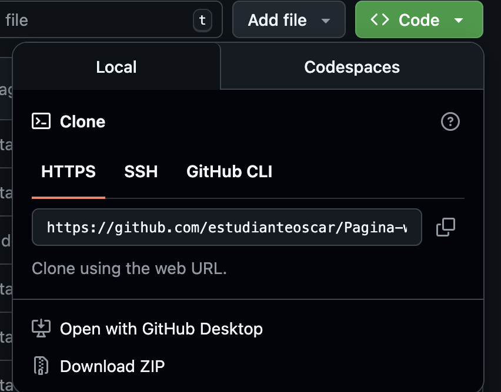

# Pagina web Derechos Fundamentales 
Sistemas de protección y Mecanismos de Acción 

---

## 🚀 Características

- ✅ Conceptos
- ✅ Protección 
- ✅ Mecanismos
- ✅ Desafios 

---

## 🛠️ Tecnologías Utilizadas

- HTML
- JavaScript
- CSS

---

## 🖼️ Capturas de Pantalla

### Vista Principal

---

## 📦 Instalación

*Opcional 

1. Tener instalado git en el equipo *
2. Clona este repositorio: 
    git clone https://github.com/estudianteoscar/Pagina-web.git *
---
3. Descargar el repositorio en formato zip

--- 
4. Descomprimir el archivo
5. Ingresar a la carpeta Pagina-web y ejecutar index.html 

---

👤 Autor

    GitHub: @estudianteoscar

  

   
